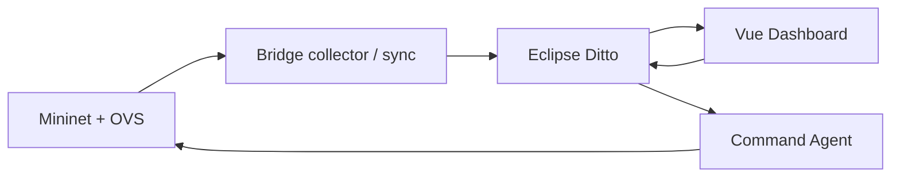

# DT4N Core

Bản lõi đề tài bản sao số mạng, tách từ DT4N. Xem [PROVENANCE.md](PROVENANCE.md) và [báo cáo nghiệm thu](results/report/ACCEPTANCE.md). Tổng kết công việc và số đo: [SUMMARY.md](SUMMARY.md).



## Kiểm tra độc lập

Đứng ở gốc kho, đặt PYTHONPATH để tránh nạp nhầm kho cũ:

```bash
python3 -m venv --system-site-packages .venv
.venv/bin/pip install -r requirements.txt
export PYTHONPATH="$PWD"
.venv/bin/python scripts/check_imports.py
.venv/bin/python -m pytest -rs
python3 -m mininet.gen_routes --spec ditto/topology_spec.json --out /tmp/rt_check.json
```

Mininet thật cần Linux, quyền root, OVS, `mn`, `mnexec`, `tc`, `iperf`. Ryu chạy trong môi trường `sdn_net` của máy nghiệm thu; trên máy khác cài môi trường Ryu tương thích. Stub chỉ hỗ trợ import, không mô phỏng số liệu mạng.

## Dựng Ditto và chạy demo

Trong `ditto/`, xem README, tạo `nginx.htpasswd` từ bản demo rồi chạy `docker compose up -d`. Không dựng thêm stack nếu cổng đang được stack khác sử dụng.

```bash
python3 -m bridge.diagnose
python3 -m bridge.bootstrap --create --spec ditto/topology_spec.json
sudo mn -c
# Dọn Mininet TRƯỚC khi bật Ryu: mn -c có thể dừng Ryu.
```

Terminal controller:

```bash
export PYTHONPATH="$PWD"
ryu-manager mininet.controller_static --ofp-tcp-listen-port 6653
```

Terminal network:

```bash
sudo env PYTHONPATH="$PWD" /usr/bin/python3 -m mininet.run_sync --period 1
```

Terminal dashboard:

```bash
cd dashboard
cp .env.example .env
npm ci
npm run dev
```

Trên VS Code Remote SSH, forward cổng **5173** để xem dashboard, **8765** để xem bảng kết quả `http://localhost:8765/report.html`. Bảng kết quả được phục vụ từ gốc kho bằng `python3 -m http.server 8765`.

## Chạy lại nghiệm thu tự động

`scripts/run_acceptance.py` dùng mạng thật, đo 30 lần sync, 30 lần command, 30 cặp disable/enable flow, 20 event verify, 4 security live test và soak 1800 giây. Namespace thí nghiệm là `org.dt4n.core`; dashboard dùng `VITE_DITTO_NAMESPACE=org.dt4n.core`.

```bash
sudo mn -c
export PYTHONPATH="$PWD"
python3 scripts/run_network_suite.py
python3 scripts/build_report.py
```

`scripts/run_network_suite.py` kiểm tra topo 5 client với spec mở rộng, rồi trở về topo 3 client cho nghiệm thu. Đường dẫn Ryu trong script là đường dẫn môi trường trên máy hiện tại; sửa nếu cài môi trường khác. Chỉ chạy một Mininet suite mỗi lần.

Để đo UI/video cùng suite, sửa `dashboard/.env` thành `VITE_DITTO_NAMESPACE=org.dt4n.core` và bật Vite; cài Playwright trong `.venv`, chạy `playwright install chromium` và `playwright install-deps chromium` (cần root cho system deps). Sau khi bắt đầu suite, chạy `.venv/bin/python scripts/dashboard_live.py` ở terminal khác; script chờ tới soak để đo 30 cặp UI và lưu video. Chạy `.venv/bin/python scripts/dashboard_last_known.py` trước khi soak kết thúc để kiểm tra trạng thái sau khi network runner dừng.

**Lưu ý lệnh trong hướng dẫn gốc:** `run_sync --long --duration 1800` không phải soak 30 phút. `--long` cần `--verify`, và duration của nhánh verify dài hạn dùng **phút**. Script nghiệm thu đo 1800 **giây** bằng đồng hồ monotonic.

## File kết quả

- `results/report/ACCEPTANCE.md`: tổng kết, bảng p50/p95 và giới hạn.
- `results/report/latency_up.json`, `latency_command.json`: thống kê, từng mẫu làm tròn từ terminal, timeout; các lần chạy sau cũng lưu mẫu gốc.
- `results/report/command_flow.json`: từng chặng của lệnh tự động; chưa thay thế phép đo UI thật.
- `docs/phase-2/verify_report.json`: completeness, accuracy trạng thái link, event fidelity.
- `results/report/soak_30min.json`: mẫu accuracy và RSS trong 30 phút.
- `logs/snapshots_normal.jsonl`, `snapshots_flood.jsonl`: dữ liệu 60 giây mỗi kịch bản.
- `logs/command_flow_measure.log`: bảng độ trễ từng chặng.
- `results/report/dashboard_*.png`, `dashboard_*.json`: ảnh và kiểm chứng trình duyệt.

Kết quả thí nghiệm không được thay thế bằng số kỳ vọng trong hướng dẫn. Bootstrap mở rộng chứng minh tạo/đọc Things, chưa xác định công suất tối đa mạng hay độ ổn định dài hạn với 20 client.
