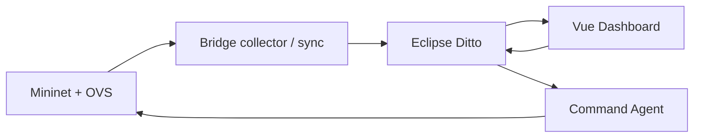

# DT4N Core

Bản lõi đề tài bản sao số mạng, tách từ DT4N. Xem [PROVENANCE.md](PROVENANCE.md) và [báo cáo nghiệm thu](results/report/ACCEPTANCE.md). Tổng kết công việc và số đo: [SUMMARY.md](SUMMARY.md).



## Kiểm tra độc lập

Đứng ở gốc kho, đặt PYTHONPATH để tránh nạp nhầm kho cũ:

```bash
python3 -m venv --system-site-packages .venv
.venv/bin/pip install -r requirements.txt
export PYTHONPATH="$PWD"
.venv/bin/python scripts/check_imports.py
.venv/bin/python -m pytest -rs
python3 -m mininet.gen_routes --spec ditto/topology_spec.json --out /tmp/rt_check.json
```

Mininet thật cần Linux, quyền root, OVS, `mn`, `mnexec`, `tc`, `iperf`. Ryu chạy trong môi trường `sdn_net` của máy nghiệm thu; trên máy khác cài môi trường Ryu tương thích. Stub chỉ hỗ trợ import, không mô phỏng số liệu mạng.

## Dựng Ditto và chạy demo

Trước khi bật Ditto trên clone sạch:

```bash
cp ditto/nginx.htpasswd.example ditto/nginx.htpasswd
cd ditto
docker compose up -d
cd ..
```

Tài khoản demo là `ditto/ditto`. Không dựng thêm stack nếu cổng đang được stack khác sử dụng.

```bash
python3 -m bridge.diagnose
python3 -m bridge.bootstrap --create --spec ditto/topology_spec.json
sudo mn -c
# Dọn Mininet TRƯỚC khi bật Ryu: mn -c có thể dừng Ryu.
```

Terminal controller:

```bash
export PYTHONPATH="$PWD"
ryu-manager mininet.controller_static --ofp-tcp-listen-port 6653
```

Terminal network:

```bash
sudo env PYTHONPATH="$PWD" /usr/bin/python3 -m mininet.run_sync --period 1
```

Terminal dashboard:

```bash
cd dashboard
cp .env.example .env
npm ci
npm run dev
```

Trên VS Code Remote SSH, forward cổng **5173** để xem dashboard, **8765** để xem bảng kết quả `http://localhost:8765/report.html`. Bảng kết quả được phục vụ từ gốc kho bằng `python3 -m http.server 8765`.

## Chạy lại nghiệm thu tự động

`scripts/run_acceptance.py` dùng mạng thật, đo 30 lần sync, 30 lần command, 30 cặp disable/enable flow, 20 event verify, 4 security live test và soak 1800 giây. Namespace thí nghiệm là `org.dt4n.core`; dashboard dùng `VITE_DITTO_NAMESPACE=org.dt4n.core`.

```bash
sudo mn -c
export PYTHONPATH="$PWD"
python3 scripts/run_network_suite.py
python3 scripts/build_report.py
```

`scripts/run_network_suite.py` kiểm tra topo 5 client với spec mở rộng, rồi trở về topo 3 client cho nghiệm thu. Đường dẫn Ryu trong script là đường dẫn môi trường trên máy hiện tại; sửa nếu cài môi trường khác. Chỉ chạy một Mininet suite mỗi lần.

Để đo UI/video cùng suite, sửa `dashboard/.env` thành `VITE_DITTO_NAMESPACE=org.dt4n.core` và bật Vite; cài Playwright trong `.venv`, chạy `playwright install chromium` và `playwright install-deps chromium` (cần root cho system deps). Sau khi bắt đầu suite, chạy `.venv/bin/python scripts/dashboard_live.py` ở terminal khác; script chờ tới soak để đo 30 cặp UI và lưu video. Chạy `.venv/bin/python scripts/dashboard_last_known.py` trước khi soak kết thúc để kiểm tra trạng thái sau khi network runner dừng.

**Lưu ý lệnh trong hướng dẫn gốc:** `run_sync --long --duration 1800` không phải soak 30 phút. `--long` cần `--verify`, và duration của nhánh verify dài hạn dùng **phút**. Script nghiệm thu đo 1800 **giây** bằng đồng hồ monotonic.

## File kết quả

- `results/report/ACCEPTANCE.md`: tổng kết, bảng p50/p95 và giới hạn.
- `results/report/latency_up.json`, `latency_command.json`: thống kê, từng mẫu làm tròn từ terminal, timeout; các lần chạy sau cũng lưu mẫu gốc.
- `results/report/command_flow.json`: từng chặng của lệnh tự động; chưa thay thế phép đo UI thật.
- `docs/phase-2/verify_report.json`: completeness, accuracy trạng thái link, event fidelity.
- `results/report/soak_30min.json`: mẫu accuracy và RSS trong 30 phút.
- `logs/snapshots_normal.jsonl`, `snapshots_flood.jsonl`: dữ liệu 60 giây mỗi kịch bản.
- `logs/command_flow_measure.log`: bảng độ trễ từng chặng.
- `results/report/dashboard_*.png`, `dashboard_*.json`: ảnh và kiểm chứng trình duyệt.

Kết quả thí nghiệm không được thay thế bằng số kỳ vọng trong hướng dẫn. Bootstrap mở rộng chứng minh tạo/đọc Things, chưa xác định công suất tối đa mạng hay độ ổn định dài hạn với 20 client.

## Dữ liệu trước ML (bản v2)

`run_sync` mặc định sinh TCP normal **2 Mbps/client** tới hai server luân phiên và UDP srv1→srv2 **2 Mbps**. Chọn `--traffic-profile server-only` để tái lập tải của nghiệm thu v1; `--traffic-profile idle` để tắt tải, hoặc `--traffic-profile flood --flood-rate 50M` cho flood. `run_phase1` có `--normal-rate`, `--rate` và `--server-bg-rate`.

`traffic.lossPct` v2 là tỷ lệ drop tại leaf qdisc của **hai chiều egress link**, không phải loss end-to-end. Trước khi dùng cho ML, kiểm tra `qdiscValid == true`; bỏ mẫu warmup/reset/unavailable. `interfaceLossPct` giữ phép đo interface cũ để đối chiếu. Các trường `qdiscCounters`, `lossSource`, `qdiscDropDelta`, `qdiscSentDelta` cho phép kiểm tra nguồn và mẫu số. Không trộn trực tiếp loss v1 và v2.

Chạy lại kiểm chứng dữ liệu và độ trễ ngẫu nhiên (mạng thật; chỉ một suite mỗi lần):

```bash
sudo mn -c
PYTHONPATH="$PWD" python3 scripts/launch_ml_preflight.py
python3 scripts/analyze_ml_preflight.py
```

Phép đo latency có tùy chọn `--randomize-phase --seed 20260915` khi gọi `run_sync --measure-latency` hoặc `--measure-command`. Giữ số đo fixed-settle v1 để đối chiếu; không coi chúng là worst-case đã chứng minh.

Dữ liệu mới: `logs/ml_normal_v2.jsonl`, `ml_flood_v2.jsonl`, `ml_injection_v2.jsonl`. Đây là pilot kiểm chứng feature, chưa phải dataset train/test hay bằng chứng hiệu quả ML. Kết quả tổng hợp: `results/report/ml_dataset_summary.json`.

Lệnh dashboard dùng Ditto `timeout=0`, sau đó xác nhận trạng thái qua sync/SSE. Outbox HTTP POST của agent là thông báo mới, không đảm bảo trả lời tương quan cho HTTP inbox đang chờ. Phép thử `timeout=3` và SSE gốc được lưu riêng ở `results/report/command_ack_timeout3.json`.

## Kiểm toán feature — Lesson 5.1

```bash
.venv/bin/python -m pip install -r requirements-phase5.lock.txt
.venv/bin/python -m scripts.audit_features
.venv/bin/python -m scripts.plot_feature_audit
.venv/bin/python -m pytest -rs
```

Chạy trên dữ liệu v2 có sẵn, không cần khởi động Mininet/Ditto. Báo cáo và giới hạn: [docs/phase-5/01-feature-audit.md](docs/phase-5/01-feature-audit.md). CSV/JSON/biểu đồ ở `results/report/feature_audit*`; chưa huấn luyện mô hình.

Kiểm tra dữ liệu thiếu (Lesson5.2):

```bash
.venv/bin/python -m scripts.analyze_missing
.venv/bin/python -m scripts.plot_missing
```

Chính sách và giới hạn: [docs/phase-5/02-missing-data.md](docs/phase-5/02-missing-data.md). Rate mới phải kiểm `rateValid`; dữ liệu v2 cũ giữ nguyên.

Thiết kế chiến dịch Lesson5.3 đã khóa trước thu:

```bash
.venv/bin/python -m scripts.build_matrix
.venv/bin/python -m scripts.plot_matrix
```

[Hợp đồng và giới hạn](docs/phase-5/03-experiment-matrix.md). Commit ma trận trước khi runner Lesson5.4 sinh dữ liệu.

Kiểm chứng harness chuẩn bị Lesson5.4:

```bash
.venv/bin/python -m scripts.check_ml_campaign
```

[Báo cáo chuẩn bị và thu mạng thật](docs/phase-5/04-data-generation.md). Lệnh chỉ kiểm tra hợp đồng/kế hoạch, không khởi động mạng.

### Chiến dịch Lesson5.4 đã thu và nghiệm thu

18/18 run đạt, 1.080 snapshot; base rate test160/590=27,12%. 163testpassed/4skipped; 0ERROR/CRITICAL/Traceback trong18logaccepted. [Kết quả và cách chạy lại](docs/phase-5/04-data-generation.md), [manifest](results/report/ml_dataset_manifest.json), [audit](results/report/campaign_feature_audit.csv), [missing](results/report/campaign_missing_analysis.json).

Raw được giữ local và có archive đã kiểm checksum18/18 theo [backup receipt](results/report/campaign_raw_backup.json); không nằm trong GitHub. Muốn audit/train từ clone cần khôi phục raw trước. Chưa đánh giá detector.


Lesson 5.5 hoàn thành: 13/13 gate; 18 run/1.080 nhãn; chính160/590=27,12%; độ nhạy80/494=16,19%. Onset tối đa10 tick, recovery tối đa2 tick; giữ kết quả grace2 không đạt và công thức y cũ. [Báo cáo](docs/phase-5/05-ground-truth.md), [JSON](results/report/ground_truth.json), [biểu đồ](results/report/label_overlay.png).


**Cập nhật Lesson 5.5b:** phép đo cũ chỉ xét onset của kênh mạnh nhất. Quét tất cả kênh dự kiến cho thấy onset sớm nhất **0 tick ở cả 8 run F**, bao gồm degrade s2–s3 trên txRate; lossPct mạnh nhất vẫn onset10. Chốt lại grace onset2/recovery2, độ nhạy144/558=25,81%; chính160/590 không đổi. Bản trước giữ ở `ground_truth_witness_grace10.json`; không diễn giải first-crossing trên nhiều kênh như bằng chứng nhân quả hay khả năng phát hiện chắc chắn của mô hình.


Lesson 5.6: **72 feature, 464 train, 590 test**; missing26tick (8fault/18normal), recall ceiling theo chính sách unknown95%. Onset sớm nhất0 ở8F, strongest loss degrade vẫn10; grace2/2. [Dataset card](docs/phase-5/06-dataset-card.md), [manifest](results/report/ml_dataset_split_manifest.json).
