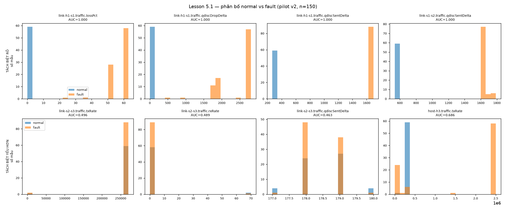

# Lesson 5.1 — Kiểm toán feature trên pilot v2

Đã thực hiện trên nhánh `phase/5-dataset`, từ commit `9192649e5fb7fbe52c7f6c7670834484189ca082`. Mục tiêu là kiểm tra từng cột trước khi xử lý missingness và xây dựng dataset nhiều run. Chưa huấn luyện mô hình.

## Cách chạy lại

```bash
.venv/bin/python -m pip install -r requirements-phase5.lock.txt
.venv/bin/python -m scripts.audit_features
.venv/bin/python -m scripts.plot_feature_audit
.venv/bin/python -m pytest -rs --junitxml=results/report/phase5_pytest.xml
```

## Đã triển khai

- `ml/schema.py`: luật loại trừ metadata, chuỗi chẩn đoán, bộ đếm cộng dồn và capacity cấu hình.
- `ml/flatten.py`: giữ feature riêng cho từng Thing/link, hỗ trợ collector và Ditto properties; bỏ object/list. Giữ null, không fillna(0); qdisc không hợp lệ không được dùng loss cached. State không rõ giữ null.
- `ml/audit.py`: nunique, tỷ lệ thiếu, std toàn bộ và từng nhóm, số mẫu hữu hạn, AUC tie-aware và Cohen’s d với pooled sample std; quyết định và lý do cho mọi cột. Giá trị vô hạn được tính là missing.
- Hai CLI sinh CSV/JSON và hình phân bố 8 ô với bin chung cho hai nhóm.
- `twin/link_direction.py`: thêm hướng tham chiếu cho đủ 8 link TriangleTopo, giữ map nghiên cứu cũ; 3 test kiểm tra map và canonical key. Hướng này định nghĩa interface đo, không có nghĩa lưu lượng chỉ chạy một chiều.

## Kết quả thực chạy

51 passed, 4 skipped, 0 failed, 0 errors. Bốn bài skip yêu cầu live Ditto + Mininet + Command Agent; lần này kiểm toán lại dữ liệu đã thu và kiểm tra map bằng test, không thu lại mạng thật. Log: [phase5_pytest.log](../../logs/phase5_pytest.log); JUnit: [phase5_pytest.xml](../../results/report/phase5_pytest.xml).

150 snapshot: normal 60 (nhãn 0), flood 60 và injection 30 (nhãn 1). 158 cột được audit; không tính cột nhãn `is_fault`.

| Quyết định | Số cột |
|---|---:|
| GIỮ | 41 |
| CHẤT VẤN | 11 |
| LOẠI | 48 |
| BỎ QUA | 58 |

Khác bảng dự kiến 42/11/48/57: `cycle_scan_ms` được xếp metadata chẩn đoán collector, tránh để mô hình học chi phí quan sát thay vì mạng. 48 cột loại gồm 10 byte counter cộng dồn, 8 capacity cấu hình và 30 cột hằng (bao gồm 8 interfaceLossPct). Capacity bị loại theo cấu trúc ngay cả khi không hằng; byte counter có thể học tuổi/thứ tự run. Tương quan với tick của từng run được lưu riêng trong JSON, không đưa vào tập feature.

Gate PASS: **37 feature GIỮ có auc_dist > 0.5**, vượt mức tối thiểu 5. Counter và capacity đã loại không được tính vào gate. GIỮ chỉ có nghĩa là ứng viên trên pilot; không khẳng định 41 cột độc lập hoặc đều cần đưa vào mô hình.

AUC = P(fault > normal) + 0.5×P(tie); auc_dist = 2×|AUC−0.5|. Cột numeric/bool bị loại nếu >50% missing hoặc hằng; chất vấn nếu auc_dist <0.10 hoặc không đủ mẫu hữu hạn ở một nhóm. AUC gần 0.5 không chứng minh hai phân bố giống nhau. d_pooled trả NaN khi phương sai gộp bằng 0 hoặc nhóm không đủ mẫu; AUC vẫn có thể đo được. Ngưỡng AUC là quy ước của audit, không tương đương toán học với d >1.

### 15 ứng viên đứng đầu

| Feature | AUC | auc_dist | d_pooled |
|---|---:|---:|---:|
| `link-h1-s1.traffic.lossPct` | 1.000000 | 1.000000 | 11.483 |
| `link-h1-s1.traffic.qdiscDropDelta` | 1.000000 | 1.000000 | 6.011 |
| `link-h1-s1.traffic.qdiscSentDelta` | 1.000000 | 1.000000 | 349.006 |
| `link-s1-s2.traffic.qdiscSentDelta` | 1.000000 | 1.000000 | 57.649 |
| `link-s2-srv1.traffic.qdiscSentDelta` | 1.000000 | 1.000000 | 56.573 |
| `host-h1.traffic.rxRate` | 0.009259 | 0.981481 | 10.848 |
| `link-h1-s1.traffic.rxRate` | 0.009259 | 0.981481 | 10.845 |
| `link-s1-s2.traffic.rxRate` | 0.010278 | 0.979444 | 7.041 |
| `host-srv1.traffic.txRate` | 0.016481 | 0.967037 | 0.332 |
| `link-s2-srv1.traffic.rxRate` | 0.016481 | 0.967037 | 0.332 |
| `host-h1.traffic.txRate` | 0.977963 | 0.955926 | 7.561 |
| `host-srv1.traffic.rxRate` | 0.977963 | 0.955926 | 6.589 |
| `link-h1-s1.traffic.txRate` | 0.977963 | 0.955926 | 7.562 |
| `link-s1-s2.traffic.txRate` | 0.977963 | 0.955926 | 6.589 |
| `link-s2-srv1.traffic.txRate` | 0.977963 | 0.955926 | 6.589 |



Bốn ô dưới là bốn feature tách biệt yếu nhất trong tập numeric không bị loại, không phải tất cả đều có AUC bằng 0.5. Nhóm fault gộp flood và injection; biểu đồ đếm mẫu hữu hạn, không bù mẫu thiếu.

## Missingness, hướng và nhịp đo

| Profile | Snapshot | Qdisc invalid / link-sample | Tick thiếu | Khoảng mẫu median (s) | Scan median (ms) |
|---|---:|---:|---|---:|---:|
| normal | 60 | 8/480 | [0] | 1.000781 | 69.583 |
| flood | 60 | 8/480 | [0] | 1.000841 | 68.124 |
| injection | 30 | 8/240 | [0] | 1.000730 | 67.049 |

Cả 24 mẫu qdisc invalid/1.200 link-sample (2%) đều là warmup ở tick 0. Đây là cơ chế thiếu quan sát được của pilot; không đủ để kết luận MCAR/MAR hay loại trừ MNAR cho fault khác. Null chưa được impute; Lesson 5.2 cần xử lý cả warmup/reset/unavailable và giữ cờ chất lượng.

Mỗi link trong cả 150 snapshot v2 vẫn có `utilDirectionSource=alphabetical_fallback`. Map mới đúng với cùng interface tham chiếu của topology hiện tại, được kiểm tra bằng test; dữ liệu gốc và nhãn provenance không bị sửa lại. Các lần thu sau dùng `directed_map` qua collector hiện có. s2→srv1 là hướng tham chiếu switch→server, trong khi UDP background srv1→srv2 có chiều ngược ở link này.

Khoảng mẫu tính từ t_source thực. Collector trừ thời gian xử lý khỏi thời gian ngủ; không cộng scan_ms vào period để suy ra cadence. `tick` là chỉ số hàng, không thay thế timestamp/dt khi tính tốc độ.

## Validation gate

- 158/158 cột có dòng audit; metadata/text có std/AUC NaN có chủ ý, không gán phép đo số cho chuỗi.
- Numeric/bool hằng bị loại; 10 counter và 8 capacity bị loại trước xếp hạng.
- 5 lossPct có biến thiên được giữ; null không được thay bằng 0.
- Có 39 ứng viên GIỮ với d_pooled >1 (đối chiếu ngưỡng effect size của plan), và 37 với auc_dist >0.5 (gate AUC riêng).
- Biểu đồ 8 ô, hướng đo và SHA-256 được lưu; toàn bộ test 51 pass/4 skip.
- **Phải chạy lại audit sau Lesson 5.4 trên dataset mới**; quyết định hằng/missing/tách biệt của pilot không tự động áp dụng cho chiến dịch nhiều run.

## Giới hạn cần chuyển sang Lesson 5.2–5.3

- Mỗi profile có một đoạn thu pilot; run_id được bổ sung từ tên file, không phải ID độc lập đã thu trong mỗi snapshot. Chưa có nhiều seed/run hoặc tập held-out.
- Normal dùng TCP 2 Mbps/client, flood dùng UDP 50 Mbps/client. Protocol, tải và profile cùng thay đổi; AUC cao của rxRate/ACK hoặc loss chưa chứng minh khả năng nhận diện fault tổng quát.
- Snapshot liên tiếp phụ thuộc thời gian; random split theo hàng có thể làm rò thông tin giữa train và test. Cần chia theo run và đa dạng hóa tải/protocol/seed.
- Injection được apply trước khi ghi file, toàn bộ 30 hàng có nhãn fault. Không có onset/offset và baseline trong run nên không đo detection delay hoặc FPR theo sự kiện.
- s2-s3 giữ background UDP gần cố định ở pilot: AUC txRate ~0.496, rxRate ~0.489, qdiscSentDelta ~0.463. Chưa thấy phân biệt đơn biến; cần fault/tải tác động vào link này để đánh giá.
- Chưa có link-down trong pilot; state_up hằng không chứng minh state không hữu ích với tập fault rộng hơn.
- Config capacity hiện tại bị loại để tránh đọc lại can thiệp của LinkDegrade; nếu xây util sau này, dùng baseline topology độc lập với fault.
- Không báo cáo accuracy/recall/AUROC mô hình, cơ chế missingness tổng quát hoặc “đã giải quyết missingness”.

## Bằng chứng và provenance

- [CSV toàn bộ 158 cột](../../results/report/feature_audit.csv): lý do từng quyết định, thống kê và số mẫu.
- [JSON tổng hợp](../../results/report/feature_audit_summary.json): gate, source SHA-256, cadence, direction và tương quan counter/tick.
- [Log audit](../../logs/feature_audit.log), [log plot](../../logs/feature_audit_plot.log), [log dependencies](../../logs/phase5_dependencies.log).
- [requirements-phase5.lock.txt](../../requirements-phase5.lock.txt): phiên bản môi trường Python 3.13.13.

| Dữ liệu gốc | SHA-256 |
|---|---|
| `logs/ml_normal_v2.jsonl` | `5999da0a215ed44ed6d8b6a08f0cedd435b3f1460293341c5605030fb5c86672` |
| `logs/ml_flood_v2.jsonl` | `70e9dd75dffd156b66d8143dfceacd1ed3acd4947cef3eb52900af612daddce1` |
| `logs/ml_injection_v2.jsonl` | `d81dc49b9e0c49db870f53d0edb22e27a91b36d8a05160103f4d713a4eda4c25` |
