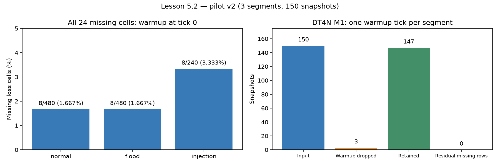

# Lesson 5.2 — Ngữ nghĩa dữ liệu thiếu

Triển khai tiếp từ commit `f4b8a19`, trên nhánh `phase/5-dataset`. Phân tích lại pilot v2; không thay đổi các JSONL gốc, không thu thêm Mininet và chưa train mô hình.

## Đã làm

- `ml/missing.py`: bảng thiếu theo ô/dòng/profile, lý do và vị trí tick; Wilson CI, Fisher hai phía; kiểm tra mọi ô thiếu có cờ/lý do warmup tại tick 0.
- Collector thêm `rateValid/rateReason` cho 5 host và 8 link (13 cờ + 13 lý do, canh 26 cột rx/tx rate). Giá trị rate vẫn là số để giữ hợp đồng consumer cũ. Khi interface link không đọc được, xuất cờ không hợp lệ và loss null để adapter xóa loss cũ.
- `mask_invalid_rates`: rate có cờ false hoặc cờ hiện diện nhưng null trở thành NaN; giữ zero thật khi valid=true. Dataset v2 cũ không có cờ không bị sửa hồi tố.
- `apply_policy`: kiểm bất biến loss, mask rate invalid, bỏ N tick đầu mỗi run theo tick dù hàng đảo thứ tự; giữ các dòng sau warmup, thêm n_loss_missing/n_rate_missing. Nếu cung cấp feature_cols, đếm số dòng đủ điều kiện train; cột vắng hoàn toàn hoặc giá trị không hữu hạn không được bỏ qua. Hàm vẫn trả các dòng giữ ở tầng 2, không trả một tập train đã dropna.
- Flatten giữ `<thing>.t_source`, schema phân loại metadata; rateReason là text, rateValid là bool.
- CLI phân tích và vẽ biểu đồ; test bảo vệ null, incomplete reason, warmup giữa run, unknown validity, feature vắng, thứ tự run/tick và nhánh collector host/link.

## Kết quả đo trên pilot

| Profile | Dòng thiếu / tổng | Ô loss thiếu / tổng | Tỷ lệ ô (%) | Wilson cell CI95 (%) * |
|---|---:|---:|---:|---|
| normal | 1/60 | 8/480 | 1.667 | [0.847, 3.254] |
| flood | 1/60 | 8/480 | 1.667 | [0.847, 3.254] |
| injection | 1/30 | 8/240 | 3.333 | [1.699, 6.439] |

Tổng **24/1.200 ô loss thiếu = 2%**; gate <5% đạt. 24/24 ô có qdiscValid=false, qdiscReason=warmup; tất cả ở tick 0. Không thấy unavailable/counter_reset trong pilot. Chính sách 1 tick/run bỏ **3/150 dòng**, giữ **147**, còn **0 ô loss thiếu**.

Kênh rate: **30 phát hiện warmup_no_prev**, tương ứng 3 đoạn thu × 5 host × 2 chiều. Không thấy rate zero trong khi byte counter tăng giữa run. **16 cột rate link không kiểm toán được từ JSONL v2** vì không có byte counter link; dữ liệu sau vá mới có nhân chứng rateValid. Không coi qdiscValid là bảo đảm cho rate.

Audit sau khi giữ timestamp: **150×174**, GIỮ41 / CHẤT VẤN11 / LOẠI48 / BỎ QUA74; 37 ứng viên mạnh theo AUC như Lesson 5.1. Số cột và bỏ qua tăng 16 do timestamp Thing; không phải thay đổi feature hay raw data.

Độ lệch giữa t_source lớn nhất và nhỏ nhất của Thing trong từng snapshot: n=150, p50=62.060 ms, p95=65.603 ms, max=70.328 ms. Đây là span thời điểm bắt đầu đọc, không phải AoI end-to-end đã đo hoặc bảo đảm nhãn không lệch khi fault đổi trong một vòng scan.



## Kết luận cơ chế và giới hạn thống kê

**MAR đối với warmup quan sát được**: cơ chế khởi tạo lịch sử phụ thuộc việc chưa có mẫu trước (biến quan sát được), không dựa vào giá trị loss chưa biết. Gate chỉ nhận kết luận này khi mọi ô thiếu được giải thích bằng false + warmup ở tick 0; chỉ có tỷ lệ nhỏ hoặc p lớn không đủ. Mã qdisc còn có warmup khi tập interface thay đổi, nên tên reason tự nó không chứng minh đây là khởi động run.

Tỷ lệ ô thô fault 2.222% và normal 1.667%; Fisher p=0.536857. Injection có đoạn thu ngắn hơn nên một tick warmup chiếm tỷ lệ lớn hơn. Sau loại tick đầu từng run: 0% và 0%.

**\* Wilson/Fisher tính theo ô giả định các mẫu độc lập.** Pilot có 8 link cùng warmup và các tick liên tiếp phụ thuộc thời gian. Vì vậy các CI và p này chỉ là số mô tả theo công thức để đối chiếu hướng dẫn, không dùng để khẳng định tỷ lệ thật dưới 0.8%, loại trừ MNAR, hoặc coi 1.200 ô là 1.200 thí nghiệm độc lập. Cần nhiều run độc lập để đánh giá bất định phù hợp. Công thức Wilson tham khảo [NIST](https://www.itl.nist.gov/div898/handbook/prc/section2/prc241.htm); định nghĩa Fisher hai phía tham khảo [SciPy](https://docs.scipy.org/doc/scipy-1.17.0/reference/generated/scipy.stats.fisher_exact.html). Không thêm SciPy vào dependencies; dùng phép tính hypergeometric trong module.

Không có missing sau warmup trong pilot nên tầng residual/train eligibility được thử bằng dữ liệu tổng hợp, chưa kiểm chứng bởi fault thật. unavailable chỉ xuất hiện lúc flood sẽ là tín hiệu cần điều tra; không tự động chứng minh MNAR vì missing còn có thể giải thích bằng biến tải quan sát được. Không kết luận hệ thống không rò bộ nhớ từ kỳ soak cũ.

## Chính sách DT4N-M1 và đối ứng Phase 7

| Tầng | Pipeline hiện có | Đối ứng inference cần triển khai ở Phase 7 |
|---|---|---|
| 1 | Bỏ N tick đầu mỗi run, đếm số bỏ | warming_up, không phát phán quyết normal |
| 2 | Giữ dòng sau warmup, null và missing indicators | Theo dõi chất lượng đo mỗi tick |
| 3 | Đếm eligibility theo đúng feature_cols, không impute zero | unknown + reason khi feature bắt buộc thiếu |

Các trạng thái Phase 7 là hợp đồng được ghi lại, **chưa có detector Phase 7 được triển khai**. Consumer đọc rate phải kiểm rateValid; consumer cũ chỉ đọc con số vẫn có thể hiển thị zero fallback khi invalid. Adapter merge-patch xóa lossPct khi qdisc invalid; flatten hỗ trợ Ditto properties và tạo loss null với cờ false ngay cả khi key loss vắng. Đường HTTP Ditto thật chưa được kiểm tra lại ở Lesson 5.2; feature_cols/reindex cần xử lý cột vắng hoàn toàn.

## Kiểm thử và chạy lại

**80 passed, 4 skipped**, không failed/error. Từ 51 tăng 29 test; file mẫu trong hướng dẫn chỉ in 12 bài, nên đã bổ sung các ca hồi quy cần thiết thay vì sử dụng con số 70 chưa đo. Bốn skip yêu cầu Ditto/Mininet/Command Agent live.

```bash
.venv/bin/python -m scripts.analyze_missing
.venv/bin/python -m scripts.plot_missing
.venv/bin/python -m scripts.audit_features
.venv/bin/python -m pytest -rs --junitxml=results/report/phase52_pytest.xml
```

- [missing_analysis.json](../../results/report/missing_analysis.json): manifest chính sách, SHA-256 nguồn, nguyên nhân, gate, thống kê và span timestamp.
- [missing_analysis.log](../../logs/missing_analysis.log): output thật của CLI.
- [phase52_pytest.log](../../logs/phase52_pytest.log), [JUnit](../../results/report/phase52_pytest.xml).
- [CSV audit mới](../../results/report/feature_audit.csv) và [summary](../../results/report/feature_audit_summary.json).

**Chạy lại phân tích missingness và audit sau Lesson 5.4** trên dataset nhiều run. Lesson 5.3 thiết kế ma trận, thu 16 run, căn đồng hồ và huấn luyện chưa thực hiện trong đợt này.
