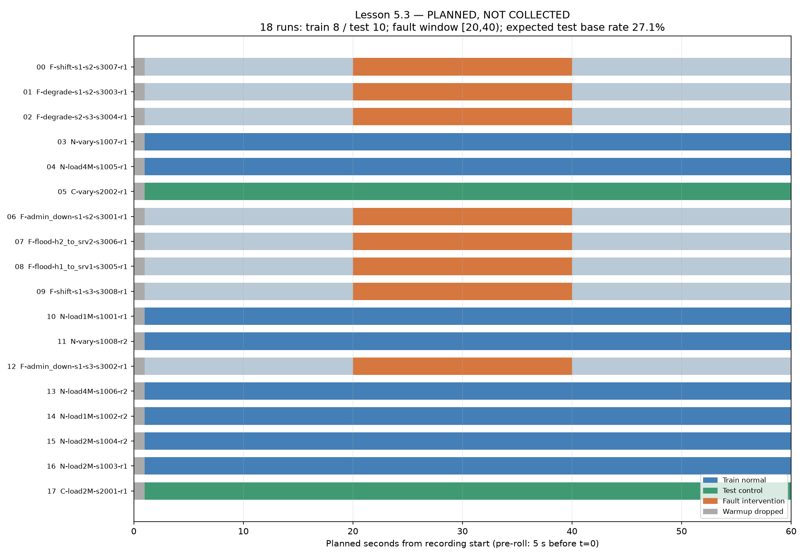

# Lesson 5.3 — Thiết kế ma trận thí nghiệm

**Trạng thái: đã thiết kế, chưa thu dữ liệu.** Triển khai tiếp từ commit `5518cca` trên nhánh `phase/5-dataset`. JSON ma trận, thứ tự và phân công train/test được commit trước Lesson 5.4. Không dùng kết quả mô hình để chọn split.

## Hợp đồng 18 run

- N: 8 train-normal — tải cố định 1/2/4 Mbps/client, mỗi mức hai seed; lịch biến thiên A hai seed.
- C: 2 test-control — TCP 2 Mbps/client và lịch biến thiên B.
- F: 8 test-fault — admin_down, degrade, flood, shift; hai target mỗi loại. Nền TCP 2 Mbps/client, UDP srv1→srv2 2 Mbps.
- Ghi 60 s/run, period 1 s; pre-roll traffic 5 s trước t=0; bỏ tick 0 vì lịch sử collector mới. Fault nằm trong [20,40) s kể từ bắt đầu ghi. Pre-roll 5 s không thay thế một tick khởi tạo collector.
- Tính nominal test: 10×59=590 tick dùng được, 8×20=160 tick fault. Base rate 160/590=0.2712 (~27,1%); always-normal accuracy nominal ~72,9%. Đây là tính trước trên lịch chuẩn, không phải kết quả detection. Runtime có jitter/missing nên sau 5.4 phải tính lại từ timestamp và sự kiện inject/revert thực.

[Bảng đầy đủ theo thứ tự thực thi](03-experiment-matrix.generated.md) · [JSON hợp đồng](../../results/report/experiment_matrix.json)



## Yếu tố điều khiển, nuisance và confound

Tải nền, profile, loại fault, target, thời lượng và split được đặt tường minh. Seed tạo severity/rate nuisance và được ghi ra JSON, không dùng để chọn target ngẫu nhiên. execution_order seed=20260915 xáo 18 run; JSON lưu exec_index mỗi run. Randomization giảm khả năng thứ tự máy trùng nhãn, không bảo đảm loại bỏ hết drift trong một chiến dịch.

Train/test tách theo run_id. Fault chỉ có ở test; normal control ở test giúp đo FPR, đồng thời các đoạn trước/sau fault vẫn có baseline. Hai seed không tự tạo ngẫu nhiên cho tải cố định nếu runner không có nguồn randomness nào sử dụng seed; các lần dựng/thu độc lập và trạng thái môi trường mới là điều cần kiểm chứng.

So với mẫu hướng dẫn, lịch A được lặp hai seed trong train, lịch B chuyển sang test-control. Gate nhóm cấu hình train xét cả schedule để không gộp hai waveform khác nhau thành hai lần lặp. Không khẳng định mọi ô fault có hai lần lặp: mỗi target-fault hiện chỉ có một run, hai run cùng loại dùng target khác nhau. Khi cần uncertainty theo từng target phải mở rộng ma trận trước thu.

Nền fault/control cùng TCP 2M giúp sửa confound nền của pilot. Flood/shift vẫn thêm UDP nên can thiệp đồng thời thay đổi tải và thành phần protocol; thiết kế này chưa tách riêng hai tác động, chưa chứng minh tổng quát trên mọi protocol. Test varying B là dạng tải hợp lệ chưa trùng waveform train, nhưng các mức tải đều đã có trong profile varying train.

## Routing và độ phủ giả thuyết

`route_paths()` đi theo next_hop thật trong routing_table.json, phát hiện vòng lặp, đối chiếu FLOW_PATHS. SHA-256 routing và topology được ghi trong JSON. Nếu đổi routing/topology, phải validate và khóa lại hợp đồng trước chiến dịch. Không có cơ chế reroute động trong controller hiện tại.

| Link | Luồng nền qua link | Có trong tập expected_links fault |
|---|---|---|
| `h1-s1` | h1->srv1 | True |
| `h2-s1` | h2->srv2 | True |
| `h3-s1` | h3->srv1 | True |
| `s1-s2` | h1->srv1, h3->srv1 | True |
| `s1-s3` | h2->srv2 | True |
| `s2-s3` | srv1->srv2 | True |
| `s2-srv1` | h1->srv1, h3->srv1, srv1->srv2 | True |
| `s3-srv2` | h2->srv2, srv1->srv2 | True |

Gate all_links_covered kiểm tra chính tập expected_links, không chỉ in bảng độ phủ. Test làm mất coverage yêu cầu all_pass=false. Các đường đi là tính toán từ routing; **giá trị/rate/drop thực không được suy ra chính xác từ đường đi** vì TCP feedback, shared queues và backpressure có thể ảnh hưởng link ngoài giả thuyết hoặc không đủ mạnh ở một link dự đoán. 8/8 là coverage của giả thuyết, không phải 8/8 link đã đo hay được detector nhận diện.

## Kịch bản và tham số đã sẵn sàng

LinkDown cũ là throttle với floor1Mbps, vẫn up. Thêm LinkAdminDown gọi configLinkStatus(down/up), không thay đổi factory RL random cũ; runner dùng scenario_for_run để chọn loại/target của ma trận. Dùng InjectionChannel trực tiếp với net_lock; luôn try/finally revert trước dọn network. Run phải bắt đầu từ baseline/up; revert không thay thế kiểm tra reset.

Mức degrade nhẹ mặc định (20–60% của20Mbps) có thể còn8–16Mbps, lớn hơn tải4Mbps qua s1-s2. Vì vậy JSON dùng severity mạnh đã seed: factor0.82–0.94 cho20Mbps; factor0.65–0.85 cho bottleneck5Mbps. Capacity floor1Mbps thấp hơn nền liên quan (4M hoặc2M). Đây là điều kiện thiết kế để tạo pressure, chưa bảo đảm loss/detection thực. Flood30–60Mbps, shift20–40Mbps srv1→srv2 trên port fault riêng.

start_varying_load dùng shell nền qua mnexec/run_host_shell và iperf TCP nối tiếp, lịch được validate trước khi thay đổi mạng. Xoay segment giữa client đa dạng hóa mức tải; với đoạn10s, ranh giới bậc vẫn đồng thời, không khẳng định đã khử thundering herd. Các lần khởi chạy iperf có overhead và tạo các TCP connection mới, nên timeline bậc có drift; runner phải log timestamp khởi động thực và profile tính từ elapsed thật.

Shell scheduler chạy trong process group riêng, lưu marker trên host. stop_all_iperf gọi stop_varying_load để TERM cả nhóm trước pkill iperf; tránh shell còn sống tạo lại tải ở bậc sau. Một test chạy process group thật kiểm tra cleanup, các test traffic khác dùng fake network; chưa đo waveform Mininet thật.

## Provenance, metadata và khóa thiết kế

git_provenance lấy full commit SHA, status không cắt mất leading space và fail khi Git không đọc được; không báo unknown/clean giả. Artifact có git_dirty=true ở thời điểm sinh vì mã thiết kế và artifact chưa commit, cùng CSV được người dùng định dạng sẵn. Đây là provenance **lúc sinh thiết kế**, không phải provenance của campaign chưa chạy. Commit khóa ma trận mô tả mã/artifact; Lesson5.4 phải ghi HEAD và dirty state thực của source thu dữ liệu, không copy hash lúc sinh thiết kế. git_dirty không tự chứng minh không tái lập được nếu còn patch lưu, nhưng commit hash một mình không mô tả working tree.

design_content_sha256=`80b94fb9a53e2341562641cc737cf0dc1a720c203b18d6168a2b58baca1d640c` tính trên constants/runs/order/split và SHA routing/topology, không phụ thuộc dirty list. Có thể chạy lại và so contract hash. Thay đổi ma trận sau thu phải là version/campaign mới, không ghi đè âm thầm vào chiến dịch đã khóa.

snapshot_metadata chuẩn bị run_id, group/split/profile, seed/exec_index, load/schedule, t_inject/t_revert, collector_version=v3-qdisc-ratevalid, period/pre_roll/warmup/duration và git hash/dirty. Chưa có snapshot 18run thật. Các field fault/target/split/run_id/time/provenance là metadata/nhãn, phải giữ ngoài model input ở Lesson5.4–5.5. Việc từ chối trộn collector version chưa được triển khai trong runner mới ở bài này; chỉ có hợp đồng metadata.

## Validation và bằng chứng chạy

**116 passed,4 skipped**; không failed/error. 4 skip cần Ditto+Mininet+Command Agent live. Từ80 tăng36 bài, gồm các test mới bổ sung vì file hướng dẫn chỉ in một phần test. build_matrix GATE PASS; audit vẫn41/11/48/74 trên150×174, missingloss2%, bỏ3 dòng còn147. CSV audit người dùng định dạng lại được giữ nguyên; không stage vào commit Lesson5.3.

| Gate | Kết quả |
|---|---|
| `run_specs_valid` | True |
| `all_links_covered` | True |
| `routes_match_committed_table` | True |
| `n_runs_ge_10` | True |
| `run_id_unique` | True |
| `seed_unique` | True |
| `no_run_in_both_splits` | True |
| `load_levels_ge_3` | True |
| `has_varying_load_profile` | True |
| `fault_types_ge_3` | True |
| `no_fault_in_train` | True |
| `test_has_normal_control` | True |
| `every_normal_config_has_2_seeds` | True |
| `base_rate_in_10_40_pct` | True |
| `all_pass` | True |

```bash
.venv/bin/python -m scripts.build_matrix
.venv/bin/python -m scripts.plot_matrix
.venv/bin/python -m pytest -rs --junitxml=results/report/phase53_pytest.xml
```

- [build_matrix.log](../../logs/build_matrix.log), [phase53_pytest.log](../../logs/phase53_pytest.log), [JUnit](../../results/report/phase53_pytest.xml).
- [Audit check](../../logs/phase53_audit_check.log), [missing check](../../logs/phase53_missing_check.log).
- Thu18run chưa bắt đầu. Nominal18×60s=18 phút ghi, thêm18×5s=90s pre-roll; tổng thời gian wall-clock dựng/reset/bootstrap chưa đo, không cam kết45–50phút hoặc2ngày.

## Giới hạn cỡ mẫu và bước sau

160 tick fault không phải160 thử nghiệm độc lập. Có8 sự kiện fault ở8run, mỗi loại hai target; CI recall tính trên ticks độc lập như hướng dẫn sẽ quá tự tin. Sau chiến dịch, báo per-run/event, cân nhắc bootstrap theo run khi đủ run, và dùng chiến dịch lặp để đánh giá uncertainty. Không dùng8run để khẳng định độ rộng CI12điểm phần trăm cho recall theo sự kiện.

Lesson5.4 cần runner đọc đúng JSON đã commit, kiểm reset baseline, ghi sự kiện thực và provenance, thu độc lập theo thứ tự; fail/revert có log, không đổi split sau nhìn dữ liệu. Sau thu phải audit/missing lại, xác nhận state_down/ratevalid/directed_map và đối chiếu coverage dự kiến. Lesson5.3 chưa chứng minh chất lượng dataset, FPR, recall, detection delay hoặc hiệu quả mô hình.
