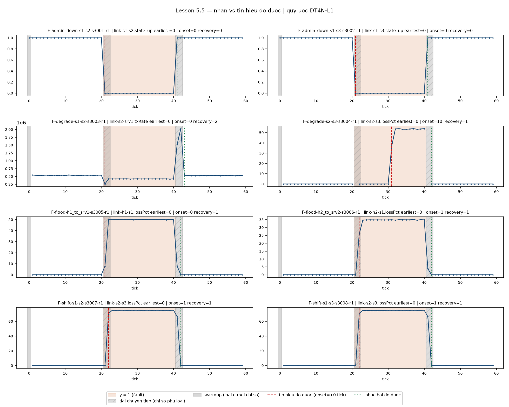

# Lesson 5.5 — Ground truth (DT4N-L1)

Quyết định trước khi triển khai:

1. Giữ y[t] = 1 khi inject_tick < t <= revert_tick; không sửa nhãn theo grace.
2. Sidecar events là nguồn nhãn. ground_truth.json là báo cáo dẫn xuất; pipeline Phase 6 phải dùng ml.labels và sidecar.
3. Grace chỉ thuộc mặt nạ độ nhạy, đề xuất onset 2 tick và recovery 2 tick; đo trước khi kết luận đủ.
4. Đánh giá chính point-wise, chỉ loại warmup; không point-adjust.
5. Ghép nhãn theo (run_id, tick), kiểm tra one-to-one; hỗ trợ dữ liệu đã lọc/sắp lại.
6. Chuỗi convention khi thu giữ nguyên; quy ước mới mang ID DT4N-L1. Không sửa hợp đồng, raw, sidecar hoặc nghiệm thu 5.4.

Nhãn mô tả can thiệp theo tick, không chứng minh toàn bộ cửa sổ đo chịu lỗi. Đồng hồ event/snapshot có chung mốc monotonic; timestamp bằng nhau là mốc ghi, không phải độ trễ thực thi bằng 0. Rate vẫn dùng timestamp nguồn và có thể bị ảnh hưởng bởi điều chỉnh đồng hồ hệ thống.

## Kết quả đo trên 18 run đã nghiệm thu

Không thu lại mạng. 1.080 nhãn, 18 warmup bị loại; 8 train N, 2 test C, 8 test F. Cả 16 event có t_rel bằng snapshot cùng tick. Công thức nhãn vẫn tạo 20 tick lỗi mỗi run F (tick 21–40).

| Run | Feature chứng nhân | Onset (tick) | Recovery (tick) | Mean z trong vùng lỗi |
|---|---|---:|---:|---:|
| F-admin_down-s1-s2-s3001-r1 | link-s1-s2.state_up | 0 | 0 | 100.0 |
| F-admin_down-s1-s3-s3002-r1 | link-s1-s3.state_up | 0 | 0 | 100.0 |
| F-degrade-s1-s2-s3003-r1 | link-s2-srv1.txRate | 0 | 2 | 12.295 |
| F-degrade-s2-s3-s3004-r1 | link-s2-s3.lossPct | 10 | 1 | 273.625 |
| F-flood-h1_to_srv1-s3005-r1 | link-h1-s1.lossPct | 0 | 1 | 478.858 |
| F-flood-h2_to_srv2-s3006-r1 | link-h2-s1.lossPct | 1 | 1 | 326.765 |
| F-shift-s1-s2-s3007-r1 | link-s2-s3.lossPct | 1 | 1 | 710.002 |
| F-shift-s1-s3-s3008-r1 | link-s2-s3.lossPct | 1 | 1 | 709.713 |

Grace onset đề xuất 2 **không đạt**: degrade s2–s3 cần 10 tick trên chứng nhân lossPct, ngưỡng z=5 giữ nguyên. Lưu toàn bộ kết quả ban đầu ở `results/report/ground_truth_initial_grace2.json`; sau đó chốt onset=10, recovery=2 cho độ nhạy. Gate thu cũ `campaign.GRACE_TICKS=2` giữ nguyên vì đó là quy tắc nghiệm thu Lesson 5.4, khác tham số đánh giá mới. ID DT4N-L1 chỉ chốt sau đo.

Kết quả cuối: **13/13 gate đạt**. Grace rộng loại 80 tick lỗi và 16 tick bình thường trên 8 run F; không dùng kết quả độ nhạy thay kết quả chính. Đây là lựa chọn dựa trên test signal, phải công bố rõ; không dùng nó để chỉnh ngưỡng mô hình hoặc báo kết quả chính thuận lợi hơn.

| Mặt nạ | Tick test sử dụng | Tick lỗi | Base rate | Always-normal accuracy |
|---|---:|---:|---:|---:|
| Chính: chỉ warmup | 590 | 160 | 0.2712 | 0.7288 |
| Độ nhạy: warmup + onset10/recovery2 | 494 | 80 | 0.1619 | 0.8381 |

| Loại | Chính lỗi/tổng | Độ nhạy lỗi/tổng |
|---|---:|---:|
| none | 0/118 | 0/118 |
| admin_down | 40/118 | 20/94 |
| degrade | 40/118 | 20/94 |
| flood | 40/118 | 20/94 |
| shift | 40/118 | 20/94 |

## Đọc tín hiệu và giới hạn



Hai admin-down hạ state_up ngay tick 21 và phục hồi tick 41. Degrade s2–s3 có lossPct tăng từ tick 31, phục hồi quan sát đầu tiên tick 42; mẫu thiếu giữ khoảng trắng. Degrade s1–s2 có thay đổi txRate ngay tick 21, overshoot sau revert rồi về nền tick 43. Flood/shift có loss tăng và hồi phục trễ 1 tick; onset flood h1 là 0, các run còn lại là 1. Không suy ra nguyên nhân queue/TCP chỉ từ biểu đồ.

Onset/recovery là **lần vượt ngưỡng/đi xuống đầu tiên**, không bảo đảm phục hồi bền vững. z = |x−mean nền| / max(std nền, sàn kênh), nền tick 1–20. z=5 là quy ước chẩn đoán; khoảng nền ngắn, tự tương quan, chọn chứng nhân tốt nhất và sàn scale khiến đây không phải kiểm định Gaussian 5-sigma. Chứng nhân chọn bằng vùng lỗi chỉ phục vụ kiểm chứng, tuyệt đối không thành feature hoặc ngưỡng detector.

`y` là nhãn can thiệp; `eval_primary` chỉ loại warmup; `eval_sensitivity` loại thêm chuyển tiếp nhưng giữ nguyên y. `attach_labels` ghép theo khóa, không theo vị trí, từ chối khóa thiếu/trùng và bảng sai độ dài. Các cột nhãn/mặt nạ/max_separation bị loại khỏi feature schema.

## Quy ước đánh giá

Chính: point-wise trên toàn bộ tick sau warmup, không point-adjust. [Kim et al., AAAI 2022](https://ojs.aaai.org/index.php/AAAI/article/view/20680) phân tích việc point-adjust làm tăng điểm đánh giá. Range-based có thể báo phụ với quy tắc công khai theo [Tatbul et al., NeurIPS 2018](https://proceedings.neurips.cc/paper/2018/hash/8f468c873a32bb0619eaeb2050ba45d1-Abstract.html).

Base rate 27,12% do thiết kế. 0,1% chỉ là ví dụ giả định, không phải số đo mạng thật. Khi giữ TPR/FPR cố định, precision = p·TPR / (p·TPR + (1−p)·FPR). Domain shift có thể thay TPR/FPR; không kết luận precision ở đây là chặn trên thực nghiệm.

Test có 430 tick bình thường: 118 thuộc hai run C, 312 trước/sau lỗi thuộc F. FPR vẫn tính được từ F; C cung cấp các run bình thường độc lập hoàn toàn với can thiệp.

## Nguồn và tái lập

Sidecar events là nguồn nhãn; raw SHA chỉ băm raw, không băm events. Báo cáo ghi riêng SHA metadata, events canonical, manifest và design để đối chiếu. `ground_truth.json` là artifact báo cáo dẫn xuất, không được dùng làm nguồn nhãn train/test Phase 6. Pipeline phải gọi ml.labels với sidecar đã kiểm chứng.

Chuỗi convention thu, ma trận ký, raw và nghiệm thu 5.4 được kiểm tra SHA trước/sau và giữ nguyên. Raw bị gitignore; clone GitHub cần khôi phục archive theo `campaign_raw_backup.json` để chạy kiểm chứng live. Test live tái lập byte-for-byte được skip rõ lý do khi thiếu raw.

Chưa huấn luyện mô hình, chưa báo precision/recall/F1. Phase 6 chỉ dùng train N để fit/đặt ngưỡng; không chỉnh theo nhãn test.

Chạy lại:

```bash
.venv/bin/python -m scripts.verify_labels
.venv/bin/python -m scripts.plot_labels
.venv/bin/python -m pytest test -ra --junitxml=results/report/phase55_pytest.xml
```

Log: `logs/phase55_verify_labels.log`, `logs/phase55_pytest.log`. Báo cáo đo: `results/report/ground_truth.json`; biểu đồ: `results/report/label_overlay.png`; màn hình: `results/report/phase55_results_screen.png`.

Validation cuối: **189 passed, 4 skipped** (bốn test lệnh live tùy chọn). Test tái lập artifact trên raw thật đã chạy, không skip.


**Cập nhật Lesson 5.5b:** phép đo cũ chỉ xét onset của kênh mạnh nhất. Quét tất cả kênh dự kiến cho thấy onset sớm nhất **0 tick ở cả 8 run F**, bao gồm degrade s2–s3 trên txRate; lossPct mạnh nhất vẫn onset10. Chốt lại grace onset2/recovery2, độ nhạy144/558=25,81%; chính160/590 không đổi. Bản trước giữ ở `ground_truth_witness_grace10.json`; không diễn giải first-crossing trên nhiều kênh như bằng chứng nhân quả hay khả năng phát hiện chắc chắn của mô hình.
