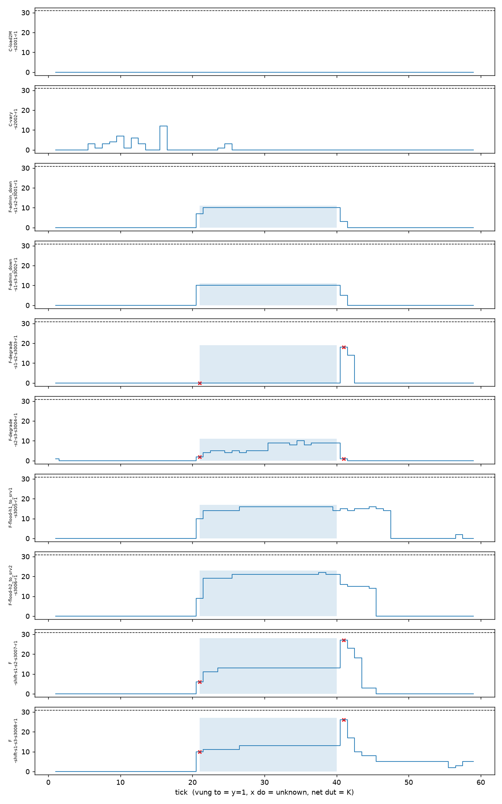

# Lesson 6.3 — Envelope baseline

## Protocol and provenance

The original preregistration remains unchanged. Amendment 2 froze the registered
column identities in every fold before calibration: 71 primary, 35 indicator,
36 shared/rate, and 8 raw link loss columns. Each fold refit only `link_stats`
and min/max bounds on its training configurations. A constant fold-training
column retained the bound `[c,c]`.

The execution boundary is visible in Git history:

| Boundary | Commit |
|---|---|
| Amendment 2, before CV | `d77e251` |
| Detector and two-stage runner | `8278eb5` |
| Frozen train-only CV artifact | `4a94dee` |
| One-shot test artifacts | `be747df` |

The CV content SHA-256 is
`0219093ee7dba8da7df2645c32adc2ed24e6d69d57a1b4dbfb6e023a9cc8b571`.
The one-shot test content SHA-256 is
`f80a17bea9c1f694e4f75e732019a934a935b05ad3167cba359c788a4046c813`.

## Train-only calibration

All 472 normal training rows were judgeable in every family. `K` is the maximum
held-out violation count and `E` is the maximum held-out normalized excess.
Alarms use strict `>`; equality does not alarm.

| Family | Columns | K | E | In-sample K |
|---|---:|---:|---:|---:|
| Primary | 71 | 31 | 8.968806 | 0 |
| Indicator | 35 | 0 | 0 | 0 |
| Shared/rate | 36 | 31 | 8.968806 | 0 |
| Loss-only | 8 | 0 | 0 | 0 |

The primary and shared/rate results coincide because all observed held-out
violations came from the shared/rate family. The 35 indicator columns were
constant on every fold-training set and remained normal in all held-out normal
rows.

| Held-out configuration | Rows | Primary k max | Share k > 0 | Constant primary columns |
|---|---:|---:|---:|---:|
| `normal|4` | 118 | 0 | 0.0% | 35 |
| `normal|2` | 118 | 1 | 24.6% | 35 |
| `normal|1` | 118 | 10 | 87.3% | 35 |
| `normal_varying|vary` | 118 | 31 | 78.8% | 35 |

The varying fold set `K=31`, while the 1 Mbps fold had the largest share of
rows with any violation. These quantities are compatible: one measures the
largest simultaneous count and the other measures how often at least one bound
is crossed. The 1 Mbps result also confirms the order-statistics risk recorded
before CV. A min/max envelope across many columns can frequently reject a new
normal row even without load extrapolation.

## Frozen test results

The primary mask contains 160 positive and 430 negative rows. The three
71-column variants have 4 unknown positive and 4 unknown negative rows, giving
a recall ceiling of 97.5%. Unknown positive rows count as false negatives;
unknown operational negative rows count as no-alarm true negatives as declared.

| Variant | Recall | 95% cluster-bootstrap CI | FPR control | FPR in fault runs | FPR all | FPR judgeable | Delay median | Censored |
|---|---:|---:|---:|---:|---:|---:|---:|---:|
| Primary count, `k > 31` | 0.0% | 0.0–0.0% | 0.0% | 0.0% | 0.0% | 0.0% | — | 8/8 |
| Secondary excess, `excess > 8.968806` | 85.6% | 60.6–99.4% | 0.0% | 7.37% | 5.35% | 5.40% | 0 | 1/8 |
| Secondary dual count | 79.4% | 54.4–98.1% | 0.0% | 0.64% | 0.47% | 0.47% | 1 | 1/8 |
| Loss-only ablation | 54.4% | 23.8–84.4% | 0.0% | 0.64% | 0.47% | 0.47% | 1 | 3/8 |

Both control runs have FPR 0 for all four variants. Thus the fixed test provides
no evidence that `C-vary` has a higher envelope FPR than `C-load2M`. The 23
false positives of the excess rule occur only in normal portions of fault runs.
Precision is reported in the JSON artifact but remains tied to this design's
27.12% base rate and is not an operational deployment estimate.

## Recall by fault and run

| Variant | Admin down | Degrade | Flood | Shift |
|---|---:|---:|---:|---:|
| Primary count | 0.0% | 0.0% | 0.0% | 0.0% |
| Secondary excess | 100% | 47.5% | 100% | 95.0% |
| Secondary dual | 100% | 25.0% | 97.5% | 95.0% |
| Loss-only | 0.0% | 25.0% | 97.5% | 95.0% |

Per-run recall, in the order of the two runs within each fault type:

| Variant | Admin down | Degrade | Flood | Shift |
|---|---|---|---|---|
| Primary count | 0 / 0 | 0 / 0 | 0 / 0 | 0 / 0 |
| Secondary excess | 1 / 1 | 0 / 0.95 | 1 / 1 | 0.95 / 0.95 |
| Secondary dual | 1 / 1 | 0 / 0.50 | 1 / 0.95 | 0.95 / 0.95 |
| Loss-only | 0 / 0 | 0 / 0.50 | 1 / 0.95 | 0.95 / 0.95 |

The loss-only delay on `F-degrade-s2-s3` is 10 ticks, within the preregistered
9–11 range. The primary count detector is censored on that run because its
largest test count remains below the frozen `K=31`. Hypothesis decisions that
compare envelope with Isolation Forest remain pending until the IF evaluation.

## Plot inspection and limitations

The shaded fault windows align with ticks 21–40. Counts increase within the
fault windows for flood, shift, admin-down, and one degrade run, while the red
unknown markers fall on the expected reset ticks. The primary threshold remains
above every observed test count, explaining its zero recall without changing
the registered decision rule.

Leave-one-configuration-out min/max calibration is deliberately pessimistic
when a held-out load lies outside the fit support. Multiple-column order effects
also inflate `K`; here that common rate threshold suppresses the otherwise clean
indicator violations. The bootstrap has only two control-run clusters, so its
FPR uncertainty is coarse. These limits motivate the preregistered excess and
dual-family secondary analyses, but do not authorize replacing the primary
detector after seeing test results.

## Hypothesis decisions from envelope evidence

Three of the five registered hypotheses are settled by envelope evidence alone,
before any Isolation Forest was fitted on campaign training data. The decisions
are derived by `scripts/build_phase6_hypothesis_ledger.py`: it verifies every
sealed source and their hash-reference chain, then applies the registered
refutation conditions. The resulting ledger has content SHA-256
`7f7ffd6c65dc5f4eb13f784ac9d6927b128de657e1e694b9bbae84945df70739`.
Every field reserved for an Isolation Forest quantity is null, and an automated
test asserts that it remains null.

| Hypothesis | Status | Decided by | Evidence |
|---|---|---|---|
| H1 | pending | requires IF | primary envelope recall on `admin_down` is 0.0 |
| H2 | **refuted** | envelope only | primary is censored on `F-degrade-s2-s3`; the registered condition says censoring refutes |
| H3 | pending | requires IF | comparator recall is 0.0, so the test has lost its power |
| H4 | **refuted** | envelope only | fold `normal\|1` share 87.29% strictly exceeds fold `vary` at 78.81% |
| H5 | **refuted** | envelope only | both control runs have FPR 0.0, so the registered strict inequality cannot hold |

H2 is a conjunction. Its loss-only clause is supported: the delay is 10 ticks,
inside the registered range [9, 11]. Its full-envelope clause fails because
`K=31` suppresses every alarm, so the conjunction is refuted even though part
of its proposed mechanism is observed.

For H4, `K=31` and the 87.29% share measure different quantities. The former
comes from the varying fold and is the largest simultaneous violation count.
The latter comes from the 1 Mbps fold and is the frequency of any violation.
Amendment 2 explicitly defined H4 using that frequency, so it settles H4.

H5's zero FPR is a consequence of a threshold that also gives zero recall. It
is therefore no evidence of generalisation to unseen load; the held-out CV
folds provide the relevant generalisation evidence and point in the other
direction.

## Exploratory diagnostics after the freeze

`results/report/phase6_envelope_posthoc_diag.json`, content SHA-256
`060c722cb61e8fe9b8e60f22f43e29002fba9042c4c040f160e56cf6b805c930`,
records post-freeze diagnostics. It declares that it uses test labels and
authorises no change to the detector, threshold, hypotheses, or column set.

The count statistic has AUC 0.9023 on judgeable rows, while excess has AUC
0.9282. Thus count retains ranking signal. However, the largest judgeable
normal count is 23 and the largest judgeable fault count is 22, so no threshold
perfectly separates the classes. An oracle test-label sweep selects `k > 3`,
with recall 85.6% and FPR 8.4%; this is exploratory and is never reportable as
detector performance. The preregistered secondary excess rule reaches the same
recall with FPR 5.4% without using test labels to select its threshold.

A pooled held-out 97.5th-percentile alternative would give `K=19`, so replacing
the registered maximum with that quantile would not resolve the structural
problem. The registered 71 columns contain at most 6 columns for one link, 3
for each endpoint host, and 5 aggregates. A deliberately generous upper bound
for a single-link fault is therefore `6 + 2×3 + 5 = 17`. Since `K=31`, the
primary count rule is structurally unable to alarm for this fault class. This
bound depends only on the registered column identities and should become a
pre-test reachability gate for future detectors.

These diagnostics distinguish spatial extent from severity. Benign load shifts
can affect many rate columns mildly, while a fault can affect fewer columns
strongly. Count measures the former; normalized excess captures the latter.

## Artifacts

- `results/report/phase6_envelope_cv.json`: fold diagnostics and frozen thresholds.
- `results/report/phase6_envelope.json`: metrics, per-fault results, delays, and bootstrap intervals.
- `results/report/phase6_envelope_ticks.csv`: scores and alarms for all 590 test rows.
- `results/report/phase6_envelope_k.png`: inspected per-run count plot.
- `results/report/phase6_hypothesis_ledger.json`: frozen confirmatory decisions.
- `results/report/phase6_envelope_posthoc_diag.json`: labelled exploratory diagnostics.
