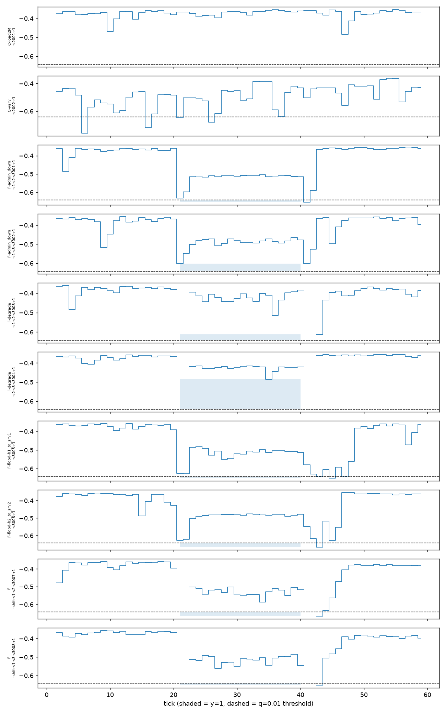
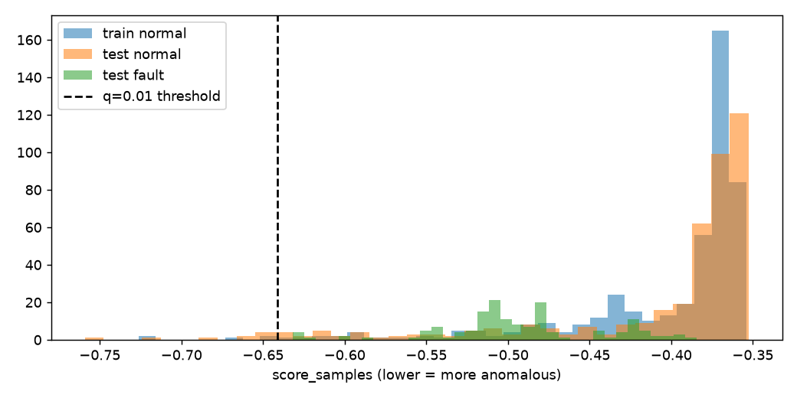

# Lesson 6.4 — Isolation Forest

## Protocol and provenance

Isolation Forest uses the 72 frozen registered features: 36 raw/aggregate
features and their 36 first differences. Each CV fold refits `link_stats`, delta
features, and the forest using only fold-training rows. The five seeds, two
`max_samples` settings, four quantiles, and all hyperparameters remain exactly
as preregistered. The final 40 thresholds were computed and frozen in
`phase6_iforest_cv.json` before any test row was scored.

The IF train matrix contains 464 rows after the first delta row from each of
eight runs is removed. Effective lower-tail sample counts are 2.32, 4.64, 9.28,
and 23.20 for q = 0.005, 0.01, 0.02, and 0.05 respectively.

## Predictions recorded before the test stage

These predictions are derived from train-only cross-validation and frozen in
`results/report/phase6_hypothesis_ledger_2.json`, content SHA-256
`c6bb53440aca94a8f67fa479eefb39e8dd5d6309896b0288b9d537ce2b6b5d0b`,
before any campaign test row was scored.

### Held-out calibration

At q = 0.01, the mean held-out alarm rate is 0.00% on each fixed-load fold and
35.17% on the varying fold. Its five-seed range is 31.03%–37.07%; even the
lowest seed is 31 times the nominal q, so the conclusion does not depend on one
random state. No IF fold-training matrix contains a constant column. The blind
spot is therefore stable across folds, unlike the envelope, where 35 of 71
columns are constant in every fold-training set.

At q ≤ 0.02 all three fixed-load folds remain exactly 0.00%. At q = 0.05 the
2 Mbps and 1 Mbps folds show small mean rates of 0.17% and 0.34%, respectively;
the varying fold rises to 63.45%. Thus the varying-fold distribution has a deep
lower-tail cluster and a second moderate cluster rather than one uniform shift.

### One-directional coverage

Holding out a fixed load leaves the varying profile in fold training, and that
profile spans the fixed levels. Holding out the varying profile leaves only
constant-load runs, which do not span its levels or transitions. This is a
one-directional coverage relation, consistent with the mechanism registered
before CV.

The p95 of row-wise maximum absolute first difference is 401,683.8 on the
varying configuration and 24,943.0 across fixed configurations, a measured
**16.1× dynamics-extrapolation factor**. The varying fold therefore
extrapolates in dynamics as well as level; 36 of 72 features are first
differences.

### What 35.17% predicts

The 35.17% does **not** predict test FPR on `C-vary`. The varying fold is a
counterfactual where both normal varying runs are removed. The final test model
trains on all four configurations, including varying traffic, so `C-vary` is
interpolation for that model. The CV result predicts Phase 7 behavior when the
detector meets a traffic profile absent from training.

The directional test prediction remains: FPR on `C-vary` should exceed FPR on
`C-load2M`; no magnitude is attached to that prediction.

### Threshold ownership and expected recall cost

For every seed, all five rows below the strict q = 0.01 full-training threshold
belong to `normal_varying|vary`. They concentrate at transition-adjacent ticks,
including 16, 26, and 36–37. Benign load dynamics therefore owns the lower tail
that sets the operational threshold. Recall is expected to be lowest for fault
types with throughput signatures milder than a normal load step, particularly
`degrade`.

### Hypothesis bookkeeping

H4 remains **refuted**. Ledger 1 froze the overall decision from envelope
evidence, and its registered refutation condition says “either detector”; IF
evidence cannot reopen that decision. The IF clause alone is supported: the
varying fold is highest for every seed, and its minimum seed rate exceeds the
maximum of every other fold.

The disagreement identifies what each detector measures. Envelope count reacts
to how often a bound is crossed, peaking at the lowest load through an
order-statistics effect. IF score reacts to how far a row lies from the learned
manifold, peaking on the varying profile. No quantile, seed, hyperparameter, or
column was changed because of these observations.

## Frozen test results

The test stage was run once after the CV artifact and both ledgers were
committed. The test artifact content SHA-256 is
`a139e3973ce099ea68091c03194aadbe9b6c53fe25af5ba69987f1b1407b0283`.
The IF recall ceiling is 152/160 = 95.0% because 8 positive ticks are unknown.

At the primary configuration (`max_samples=256`, q=0.01), mean recall over
five seeds is **0.13%** (sample SD 0.28%, range 0–0.625%). Four seeds detect no
positive tick; seed 4 detects one `admin_down` tick. Mean FPR is **2.37%**
(SD 0.80%, range 1.63–3.72%). All eight incidents are censored for four seeds;
seven are censored for seed 4.

| q | Mean recall | Mean FPR | Recall range | FPR range |
|---:|---:|---:|---:|---:|
| 0.005 | 0.00% | 1.21% | 0–0% | 0.93–1.63% |
| 0.010 | 0.13% | 2.37% | 0–0.63% | 1.63–3.72% |
| 0.020 | 2.50% | 4.65% | 0.63–3.13% | 3.72–5.12% |
| 0.050 | 13.63% | 8.70% | 11.25–16.25% | 8.60–8.84% |

At q=0.01, `C-load2M` has FPR 0 for every seed while `C-vary` has mean FPR
7.80% (range 6.78–8.47%). The registered directional prediction is therefore
supported. The magnitude remains distinct from the counterfactual 35.17% CV
rate, exactly as recorded before test. Mean FPR is 3.90% on control runs and
1.79% on normal portions of fault runs.

The `max_samples=1.0` secondary setting gives zero recall for every seed at
q=0.01 and the same mean all-negative FPR of 2.37%. No feature is never split
across all five seeds under either setting.

## Noise control

The Gaussian noise arm uses the same 464×72 train and 590×72 test dimensions,
the same primary quantile and the campaign unknown mask. Its mean recall is
1.38% (range 0.63–1.88%) and mean FPR is 1.12%. The campaign IF's 0.13% recall
is lower than this control, while its FPR is higher. This does not mean the
score lacks ranking signal. At the registered point its alarms concentrate on
benign varying-load rows and are anti-correlated with fault labels; the
post-freeze AUC analysis below finds signal in the middle of the distribution.

## Final hypothesis decisions

Ledger 3 was frozen after the one-shot IF evaluation and before oracle or
hybrid exploration. All five registered hypotheses are refuted. H1 is refuted
by the registered five-seed mean: envelope admin-down recall is 0, while IF
mean recall is 0.005 because seed 4 detects one of 40 ticks. The channel
mechanism remains supported—dual-envelope recall is 1.0 and loss-only recall is
0—but primary envelope calibration suppresses it. H3 is refuted because IF-only
positive ticks are `0,0,0,0,1`, below eight in every seed. H2, H4 and H5 retain
their earlier refuted status.

The final ledger is `results/report/phase6_hypothesis_ledger_3.json`, content
SHA-256 `10c8be5fee6501cfcb208b9f408520e378251cd08d85e346770390b106fc5556`.

## Exploratory tail-inversion diagnostic

On the 564 rows judgeable by both detectors, AUC is 0.9307 for excess, 0.9094
for count and 0.8656 for negative IF score. IF therefore has ranking signal.
Its registered threshold lies below every judgeable fault score: the most
anomalous benign varying-load row extends farther into the lower tail than the
most anomalous fault row. This **tail inversion** explains how AUC can be high
while primary recall is essentially zero.

Count fails differently. Its fault tail extends beyond its benign tail on the
common rows, but held-out calibration sets `K=31` above both; this is calibration
overshoot. IF's tail order itself is inverted. Oracle Youden-J values are 0.810
for excess, 0.761 for count and 0.688 for IF.

At the registered seed-0 point, excess has 134 TP and 20 FP on the common
denominator. IF adds no unique TP and five FP, so `excess OR IF` leaves recall
unchanged and raises FPR from 4.65% to 5.81%. This analysis is exploratory and
authorises no detector or threshold change. Its artifact SHA-256 is
`5a569995c0d7d64b857af8d00e2eeab8772ae6753d37af2adc5bed06b0a01807`.

## Plot inspection

The fault windows and run ordering align with the frozen keys. Fault scores
mostly remain above the strict threshold. Low-score excursions occur primarily
in varying-load normal traffic and post-window transitions, matching the
train-only threshold-ownership diagnosis.

## Artifacts

- `results/report/phase6_iforest_cv.json`: train-only folds, 40 frozen thresholds, tail ownership and dynamics profile.
- `results/report/phase6_hypothesis_ledger_2.json`: append-only H4 clause decision and pre-test predictions.
- `results/report/phase6_hypothesis_ledger_3.json`: final H1–H5 decisions before hybrid exploration.
- `results/report/phase6_iforest_posthoc_diag.json`: exploratory tail and seed-0 hybrid diagnostic.
- `results/report/phase6_iforest.json`: one-shot metrics, split usage and noise control.
- `results/report/phase6_iforest_ticks.csv`: primary seed-0 test scores and alarms.
- `results/report/phase6_iforest_scores.png`: inspected score timeline.
- `results/report/phase6_iforest_score_dist.png`: inspected train/test distributions.
